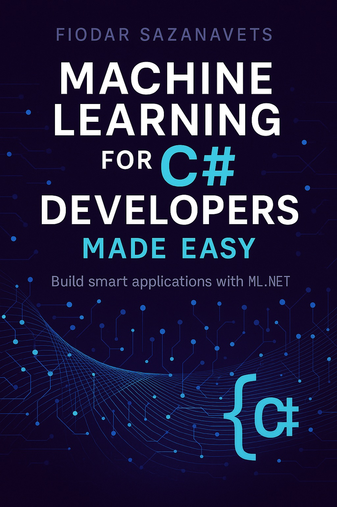

# ML.NET code samples

This repository provides code samples for various machine learning scenarios implemented by ML.NET.

These examples are used in the following book:

**Machine Learning for C# Developers Made Easy - Build smart applications with ML.NET**

[Get EPUB or PDF](https://leanpub.com/machine-learning-for-csharp-developers-made-easy)

[Get a Kindle copy](https://www.amazon.com/Machine-Learning-Developers-Made-Easy-ebook/dp/B0GX34VTL8/ref=tmm_kin_swatch_0)

[Get a paperback](https://www.amazon.com/Machine-Learning-Developers-Made-Easy/dp/B0GXGV23JK/ref=sr_1_10)